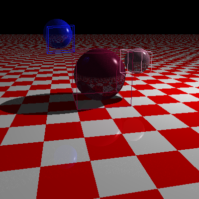

# rays.rust
[](https://travis-ci.org/peterbraden/rays.rust)



A rust implementation of a raytracer.

This is the latest in a series of raytracers I've implemented to learn languages
and explore algorithms. Probably not interesting to anyone else.

- [Rays (c++)](https://github.com/peterbraden/rays)
- [JS Raytracer](https://github.com/peterbraden/js-raytracer)


## Install / Run
```
cargo run demo/demo.json
```
