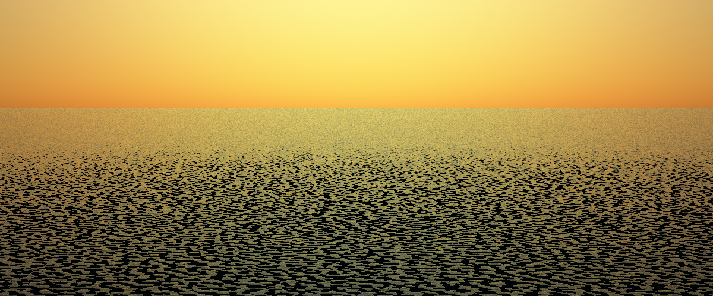
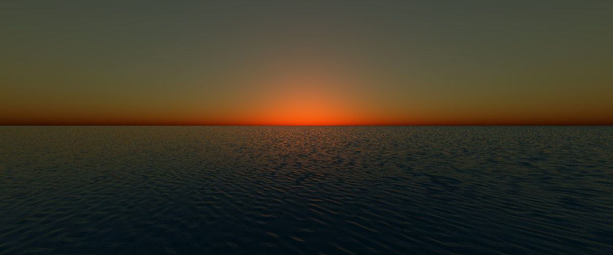
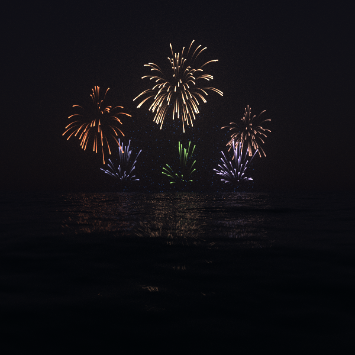

# rays.rust
[](https://travis-ci.org/peterbraden/rays.rust)

## Gallery







## Current work


A raytracer written in rust.

Supports:

  - Tracing (Integrator)
    - Whitted tracing
    - Path tracing with basic Monte-Carlo global illumination
      - Lambertian 
      - Specular
      - Dielelectric

  - Objects
    - Sphere
    - Plane
    - Mesh
    - OBJ file to mesh import
    - Infinite Repeating Mesh

  - Skysphere with Rayleigh and Mie Scattering
  - Procedural Objects
    - [Ocean (Tessendorf's algorithm with Phillips spectrum)](./src/ocean.rs)
    - Random Cubes
		- Fireworks

  - Multithreaded
  - Progressive rendering


## Install / Run
```
cargo run --release -- -p demo/demo.json
```

## Blog Posts

- [Simulating Ocean Waves](https://peterbraden.co.uk/article/simulation-ocean-waves/)

## References
- [An Efficient Parametric Algorithm for Octree Traversal, J. Revelles, C. Urena, M. Lastra](http://wscg.zcu.cz/wscg2000/Papers_2000/X31.pdf)
- [Simulating Ocean Water, J. Tessendorf](http://citeseerx.ist.psu.edu/viewdoc/download?doi=10.1.1.161.9102&rep=rep1&type=pdf)
- [Physically Based Raytracing, M. Pharr, W. Jakob, G. Humphreys](http://www.pbr-book.org/)


## Previous Work

This is the latest in a series of raytracers I've implemented to make art,
learn languages, and explore algorithms.

- [Rays (c++)](https://github.com/peterbraden/rays)
- [JS Raytracer](https://github.com/peterbraden/js-raytracer)
